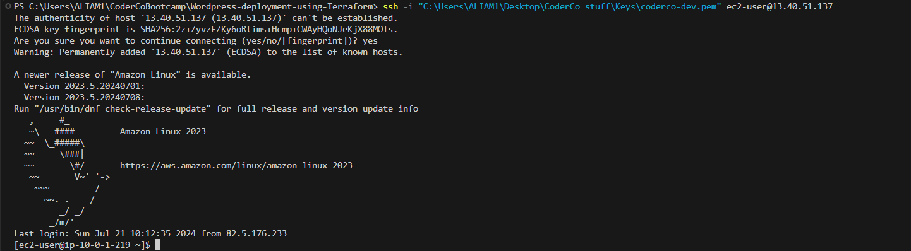
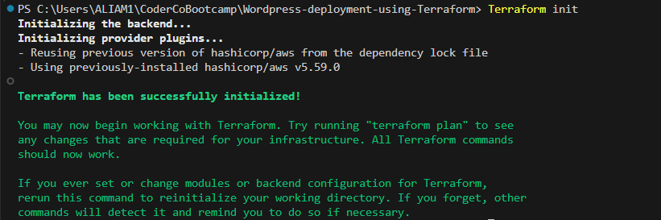
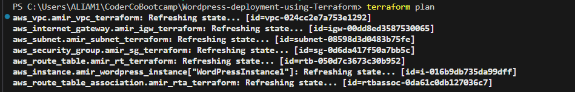
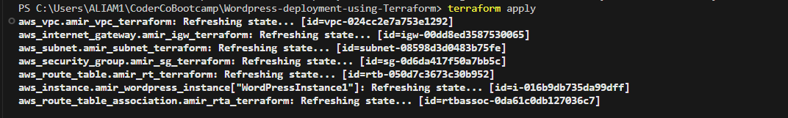
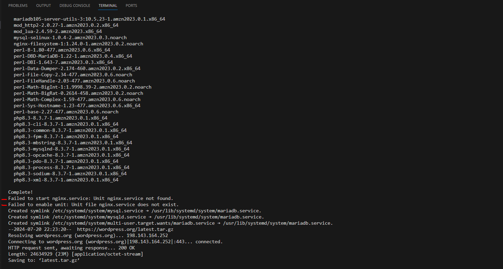
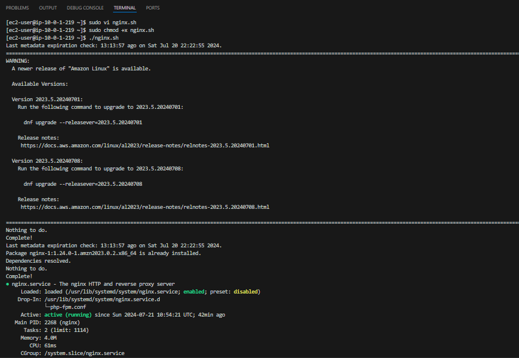
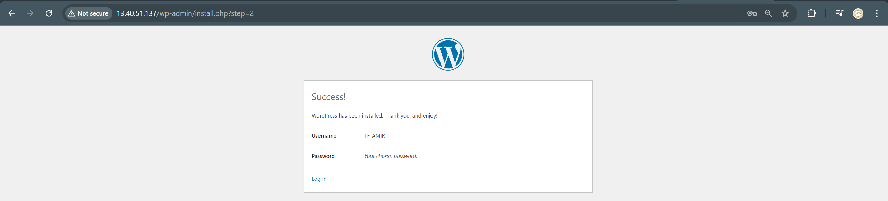

<h1 align="center">
  <br>
  
  <br>
  Deploying WordPress on AWS with Terraform
  <br>
</h1>

## Introduction

Welcome to the "WordPress on AWS with Terraform" project! This guide helps you automate the deployment of a WordPress site on AWS using Terraform. By the end, you'll have a fully functional WordPress site on an EC2 instance.

> [!NOTE]
> This Terraform project documentation includes the following components:

1. **VPC:** A Virtual Private Cloud to isolate resources.

2. **Subnet:** A public subnet within the VPC.

3. **Internet Gateway:** Allows the instance to access the internet.

4. **Route Table:** Manages routing rules for the subnet.

5. **Security Group:** Controls inbound and outbound traffic to the instance.

6. **EC2 Instance:** Hosts the WordPress site.

7. **Nginx:** Web server to serve WordPress.

8. **PHP:** Required for WordPress to run.

9. **MariaDB:** Database server for WordPress data.

10. **User Data Script:** Automates the installation and configuration of WordPress, Nginx, PHP, and MariaDB.

## Prerequisites

Before starting this project, I had the following prepared:

- **AWS Account:** An active AWS account to deploy resources.
- **Terraform Installed:** Terraform installed on my local machine and declared in the system's PATH variable for easy access.
- **Visual Studio Code:** Used as the code editor to write and manage my Terraform configuration files.
- **Git Bash:** Utilised for running SSH commands and managing instances.
- **SSH Key Pair:** Created in the AWS Management Console for accessing my EC2 instances.

> [!TIP]
> Ensure your AWS account is configured with appropriate access to create resources like VPCs, subnets, EC2 instances, and security groups.

## Project Structure

The project is organized into several key files:

- `main.tf`: Core infrastructure components
- `variables.tf`: Input variables
- `output.tf`: Output values

## Why is Infrastructure as Code (IaC) So Important?

> [!NOTE]
> **Consistency and Repeatability:**  
> IaC ensures that the same configuration is applied every time infrastructure is provisioned, reducing the risk of human error. This consistency helps avoid configuration drift and ensures reliable environments.

> [!TIP]
> **Version Control:**  
> Infrastructure configurations can be stored in version control systems like Git. This allows for tracking changes, collaborating on infrastructure development, and rolling back to previous versions if needed.

> [!IMPORTANT]
> **Automation:**  
> IaC allows for automated provisioning, updating, and scaling of infrastructure. Automation reduces manual effort, speeds up deployment processes, and allows for continuous integration and delivery (CI/CD) pipelines.

> [!NOTE]
> **Scalability:**  
> IaC tools can easily scale infrastructure up or down based on defined parameters. This flexibility ensures that infrastructure can meet varying demands without extensive manual intervention.

> [!NOTE]
> **Documentation:**  
> The code itself serves as documentation of the infrastructure setup. This makes it easier to understand the configuration, onboard new team members, and ensure compliance with organizational standards.

> [!TIP]
> **Cost Management:**  
> IaC can automate the teardown of resources when they are no longer needed. This helps in optimizing resource utilization and managing costs effectively.

> [!WARNING]
> **Disaster Recovery:**  
> IaC enables the quick re-creation of infrastructure in the event of a failure. This improves disaster recovery capabilities and reduces downtime.

> [!NOTE]
> **Testing and Validation:**  
> Infrastructure can be tested and validated before deployment. This ensures that changes do not break existing setups and meet the required standards.

## Step 1: Install Terraform

First, I ensured Terraform was installed on my machine. Terraform is essential for automating the creation and management of infrastructure. It allows us to define our infrastructure as code.

Download Terraform from the official website.
Follow the installation instructions for your operating system.
Verify the installation by running terraform --version in your terminal.

## Step 2: Create Terraform Configuration Files

Purpose: These files define the infrastructure you want to create.

Instructions:

I created several Terraform configuration files to define the infrastructure. These files included main.tf, variables.tf, and outputs.tf.

1. Create a new directory for your Terraform configuration files.

2. Inside this directory, create the following files:

```
Example Directory Structure:


terraform-project/
  - main.tf
  - variables.tf
  - terraform.tfvars
  - outputs.tf
  ```

## Step 3: Create an SSH Key Pair if you haven't already.

Instructions:

1. Go to the AWS Management Console
2. Navigate to EC2 > Key Pairs.
3. Create a new key pair and download the .pem file to a safe location

**Why?:** This key pair will be referenced in your Terraform configuration to enable SSH access to your EC2 instances.

For example when I connected to my EC2 instance via ssh, I did:
ssh -i "C:\Users\ALIAM1\Desktop\CoderCo stuff\Keys\coderco-dev.pem" ec2-user@3.8.22.187   



## Step 4: Define the Key Pair in Terraform

Purpose: Reference the SSH key pair in your Terraform configuration to allow access to your instances.

- Update the 'terraform.tfvars' file with your key pair name.

```
Example:

region = "eu-west-2"
key_name = "coderco-dev"
```

## Step 5: Define Variabels in 'variables.tf'

### `variables.tf`

Purpose: Variables allow you to parameterise your Terraform configuration.

```
Example:

variable "region" {
  description = "AWS region"
  type        = string
  default     = "eu-west-2"
}

variable "instance_type" {
  description = "EC2 instance type"
  type        = string
  default     = "t2.micro"
}

variable "key_name" {
  description = "Key name for SSH access"
  type        = string
}

variable "vpc_cidr" {
  description = "VPC CIDR block"
  type        = string
  default     = "10.0.0.0/16"
}

variable "subnet_cidr" {
  description = "Subnet CIDR block"
  type        = string
  default     = "10.0.1.0/24"
}

variable "instance_count" {
  description = "Number of EC2 instances"
  type        = number
  default     = 1
}
```

## Step 6: Define the Main Terraform Configuration in 'main.tf'

### `main.tf`

Purpose: This file defines the AWS infrastructure resources.

This file contains the primary infrastructure definition. It includes resources like VPCs, subnets, security groups, and EC2 instances. This file also includes a bash script to automate installing and running Nginx, PHP, MariaDB. So when the EC2 gets initilaised, the bash script should run and host Wordpress on the EC2 instance.

```
# Define the provider as AWS and specify the region
provider "aws" {
  region = var.region
}

# Create a VPC (Virtual Private Cloud)
resource "aws_vpc" "amir_vpc_terraform" {
  cidr_block = var.vpc_cidr  # CIDR block for the VPC
  tags = {
    Name = "amir-vpc-terraform-01"  # Tag for easy identification
  }
}

# Create a public subnet within the VPC
resource "aws_subnet" "amir_subnet_terraform" {
  vpc_id                  = aws_vpc.amir_vpc_terraform.id  # Associate with the VPC
  cidr_block              = var.subnet_cidr  # CIDR block for the subnet
  map_public_ip_on_launch = true  # Automatically assign public IPs to instances
  tags = {
    Name = "amir-subnet-terraform-01"  # Tag for easy identification
  }
}

# Create an Internet Gateway for internet access
resource "aws_internet_gateway" "amir_igw_terraform" {
  vpc_id = aws_vpc.amir_vpc_terraform.id  # Associate with the VPC
  tags = {
    Name = "amir-igw-terraform-01"  # Tag for easy identification
  }
}

# Create a route table for the VPC
resource "aws_route_table" "amir_rt_terraform" {
  vpc_id = aws_vpc.amir_vpc_terraform.id  # Associate with the VPC

  route {
    cidr_block = "0.0.0.0/0"  # Route all traffic to the Internet Gateway
    gateway_id = aws_internet_gateway.amir_igw_terraform.id
  }

  tags = {
    Name = "amir-rtb-terraform-01"  # Tag for easy identification
  }
}

# Associate the route table with the subnet
resource "aws_route_table_association" "amir_rta_terraform" {
  subnet_id      = aws_subnet.amir_subnet_terraform.id  # Associate with the subnet
  route_table_id = aws_route_table.amir_rt_terraform.id  # Associate with the route table
}

# Create a security group for the EC2 instances
resource "aws_security_group" "amir_sg_terraform" {
  vpc_id = aws_vpc.amir_vpc_terraform.id  # Associate with the VPC

  # Allow SSH access
  ingress {
    from_port   = 22
    to_port     = 22
    protocol    = "tcp"
    cidr_blocks = ["0.0.0.0/0"]
  }

  # Allow HTTP access
  ingress {
    from_port   = 80
    to_port     = 80
    protocol    = "tcp"
    cidr_blocks = ["0.0.0.0/0"]
  }

  # Allow all outbound traffic
  egress {
    from_port   = 0
    to_port     = 0
    protocol    = "-1"
    cidr_blocks = ["0.0.0.0/0"]
  }

  tags = {
    Name = "amir-sg-terraform-01"  # Tag for easy identification
  }
}

# Define instance names
locals {
  instance_names = ["WordPressInstance1"]
}

# Create an EC2 instance to host WordPress
resource "aws_instance" "amir_wordpress_instance" {
  for_each               = toset(local.instance_names)  # Create instances based on the defined names
  ami                    = "ami-05d929ac8893c382f"  # Amazon Linux 2 AMI
  instance_type          = var.instance_type  # Instance type
  subnet_id              = aws_subnet.amir_subnet_terraform.id  # Associate with the subnet
  vpc_security_group_ids = [aws_security_group.amir_sg_terraform.id]  # Associate with the security group
  key_name               = var.key_name  # Key pair for SSH access

  # User data script to set up the instance
  user_data = <<-EOF
    #!/bin/bash

    # Update package list and install Nginx
    sudo yum update -y
    sudo yum install -y nginx
    
    # Start and enable Nginx
    sudo systemctl start nginx
    sudo systemctl enable nginx

    # Install PHP and necessary extensions
    sudo yum install -y php8.3 php8.3-mysqlnd

    # Start and enable PHP-FPM
    sudo systemctl start php-fpm
    sudo systemctl enable php-fpm

    # Install MariaDB (MySQL)
    sudo yum install -y mariadb105-server mariadb105

    # Start and enable MariaDB
    sudo systemctl start mariadb
    sudo systemctl enable mariadb

    # Secure MariaDB installation
    sudo mysql -e "UPDATE mysql.user SET Password=PASSWORD('***********') WHERE User='root';"
    sudo mysql -e "DELETE FROM mysql.user WHERE User='';"
    sudo mysql -e "DROP DATABASE test;"
    sudo mysql -e "FLUSH PRIVILEGES;"

    # Create WordPress database and user
    sudo mysql -u root -p*********** -e "CREATE DATABASE wordpress;"
    sudo mysql -u root -p*********** -e "CREATE USER 'wp_amir'@'localhost' IDENTIFIED BY '***********';"
    sudo mysql -u root -p*********** -e "GRANT ALL PRIVILEGES ON wordpress.* TO 'wp_amir'@'localhost';"
    sudo mysql -u root -p*********** -e "FLUSH PRIVILEGES;"

    # Download and extract WordPress
    cd /var/www/html
    sudo wget https://wordpress.org/latest.tar.gz
    sudo tar -xzf latest.tar.gz
    sudo mv wordpress/* .
    sudo rm -rf wordpress latest.tar.gz

    # Set permissions for WordPress files
    sudo chown -R nginx:nginx /var/www/html
    sudo find /var/www/html/ -type d -exec chmod 755 {} \;
    sudo find /var/www/html/ -type f -exec chmod 644 {} \;

    # Configure wp-config.php
    sudo cp wp-config-sample.php wp-config.php
    sudo sed -i "s/database_name_here/wordpress/" wp-config.php
    sudo sed -i "s/username_here/wp_amir/" wp-config.php
    sudo sed -i "s/password_here/***********/" wp-config.php
    
    # Create Nginx configuration for WordPress
    sudo bash -c 'cat <<EOT > /etc/nginx/conf.d/wordpress.conf
    server {
        listen 80;
        server_name 3.8.22.187; # Replace with your public EC2 IP or domain
        root /var/www/html;
        index index.php index.html index.htm;
        location / {
            try_files \$uri \$uri/ /index.php?\$args;
        }
        location ~ \.php$ {
            include /etc/nginx/fastcgi_params;
            fastcgi_pass unix:/var/run/php-fpm/www.sock;
            fastcgi_index index.php;
            fastcgi_param SCRIPT_FILENAME \$document_root\$fastcgi_script_name;
        }
        location ~ /\.ht {
            deny all;
        }
    }
    EOT'
    # Restart Nginx to apply the configuration
    sudo systemctl restart nginx
  EOF

  tags = {
    Name = "WordPressInstance1"  # Tag for easy identification
  }
}
```
**Explanation:**

- **Provider Block:** Specifies the AWS region.
- **PC, Subnet, Internet Gateway, Route Table:** Defines network infrastructure.
- **Security Group:** Configures security rules for SSH (port 22) and HTTP (port 80).
- **EC2 Instance:** Creates an EC2 instance with a user data script to install and configure Nginx, PHP, MariaDB, and WordPress.

## Step 7: Define Outputs in 'outputs.tf'

### `outputs.tf`
Purpose: The output block in Terraform is used to display certain values after the infrastructure has been created or updated. In this specific case, the output "wordpress_public_ips" block is configured to display the public IP addresses of the EC2 instances running WordPress.

```
output "wordpress_public_ips" {
  description = "The public IP addresses of the WordPress instances"
  value       = { for instance in aws_instance.wordpress_instance : instance.id => instance.public_ip }
}
```
**Explanation:**

Here's a breakdown of what each part of this block does:

- **output:** "wordpress_public_ips": Declares an output variable named wordpress_public_ips.

- **description:** Describes the purpose of this output variable.

- **instance.id => instance.public_ip:** Maps each instance's ID to its public IP address.

- **value:** Uses a for-each loop to iterate over all instances created by the aws_instance.amir_wordpress_instance resource. It collects the public_ip attribute of each instance and maps it to the instance's ID. It looks in the main.tf file and looks for the "resource "aws_instance" "amir_wordpress_instance"" block and puts it in a for loop. But my variables.tf only has the count of 1 EC2 to be created, I can change that to 4-5 so that this for loop comes in more effective.  

I'd need to update the main.tf file to:

```
tags = {
    Name = "WordPressInstance${count.index + 1}"
  }
}
```

And I'd need to update the outputs.tf file to:

```
output "wordpress_public_ips" {
  description = "The public IP addresses of the WordPress instances"
  value       = { for index, instance in aws_instance.amir_wordpress_instance : index => instance.public_ip }
}
```

## Step 8: Initialise, plan and apply Terraform configuration

1. Initialise Terraform - this prepares the working directory for use with Terraform

```
terraform init
```
- terraform init: Prepares the working directory for use with Terraform.




2. Plan the Deployment

```
terraform plan
```
- terraform plan: Creates an execution plan, showing what actions will be taken.




3. Apply the Configuration
```
terraform apply
```


- terraform apply:  Executes the actions proposed in the plan to create the resources.

## Step 9: Checking the log to see if the services required to run Wordpress installed without any errors.


As you can see everything installed except Nginx server, and if you look back in my main.tf file the commands are correct and if I run the same command manually in my terminal, it installs fine so what I did as a workaround was to quickly create a bash script within the terminal to install, start and enable Nginx server so that I can host Wordpress successfully. See below on how I did it.

The command sudo cat /var/log/cloud-init-output.log does the following:

- sudo: Runs the command with superuser (root) privileges. This is necessary because the log file might not be readable by a regular user.
- cat: Concatenates and displays the content of files.
- /var/log/cloud-init-output.log: Specifies the file to be read and displayed. This is a log file created by the cloud-init service.




## Step 10: Creating a bash script within the terminal of the EC2 to workaround this.

1. Created the bash script by doing the following:
```
sudo vi nginx.sh
```

2. Added the following content:

```
#!/bin/bash

sudo yum install nginx
sudo systemctl start nginx
sudo systemctl enable nginx
sudo systemctl status nginx
```

3. Make the Script Executable:

```
sudo chmod +x nginx.sh
```

4. Run the script

```
./nginx.sh
```
## Final result of the workaround bash script, ensuring the service is installed, enabled and started




## Step 11: Configuring WordPress

As you can see now, I have now installed Wordpress on the EC2 configured with Terraform




## Summary: 

I have not used modules in this project. All my resources and configurations are directly declared within main.tf. To use modules, I would need to create separate directories for logical groupings of resources, each with their own main.tf, variables.tf, and outputs.tf files, and then reference these modules from my root main.tf using the module block. I hope to do this in my next terraform project.
